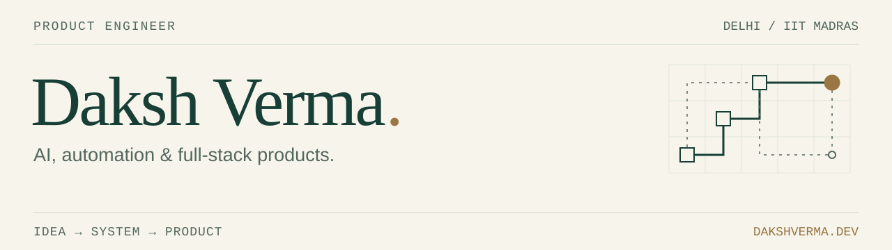

  

  
  
  
  

### About

Most of what I've built sits in the gap between "technically impressive" and "someone actually wants this." I've been on both sides of that gap enough times to trust the second one more.

I'm the technical owner of a live consumer product right now, the kind of work where the code, the users, and the judgment calls are all mine to get right. Before that: national hackathon wins, and production software used by 47,000+ students at IIT Madras.

- **Studying:** DBMS and Machine Learning Foundations, IIT Madras Diploma coursework.
- **Working on:** closing the gap between shipping fast and understanding the system underneath.
- **Writing about:** AI, product, and the reasoning behind building things people trust. ([dakshverma.dev](https://dakshverma.dev))

---

### Hackathon record

| Result | Event | Project |
|:---|:---|:---|
| 1st Place | GDG Vertex AI Hackathon | CareSRE |
| 2nd Runner-Up | Innov8 3.0, IIT Delhi | IntervAI |
| 2nd Runner-Up | Agentic Among Us (Eightfold AI x IIT Delhi) | Multi-agent system |
| Top 12 of 250,000+ | India's largest civic-tech hackathon | Civic tech |

---

### Stack

Next.js, TypeScript, Tailwind, Node.js, Python, PostgreSQL, Supabase. Working with multi-LLM systems day to day: Anthropic, OpenAI, Groq, OpenRouter for routing, and ElevenLabs for voice.

---

### Selected builds

- **[CareSRE](https://github.com/dakshverma-dev/CareSRE)**: AI-powered outpatient queue management for government hospitals. 1st place at the GDG Vertex AI Hackathon, out of roughly 2,400 teams. Won by keeping the build simple and spending the time on whether a hospital would actually use it.
- **[IntervAI](https://github.com/dakshverma-dev/IntervAI)**: real-time AI candidate interviewer. 2nd Runner-Up, Innov8 3.0 at IIT Delhi.
- **[Agentic Amongus](https://github.com/dakshverma-dev/Agentic-Amongus)**: a multi-agent deception and deduction system. 2nd Runner-Up, Agentic Among Us.
- **ConsentChain**: tamper-proof, auditable consent records on Algorand, built around India's DPDP Act.

---

<em>The game everyone's playing and the game you're actually scored on are often two different things. The trick is spotting the gap.</em>

